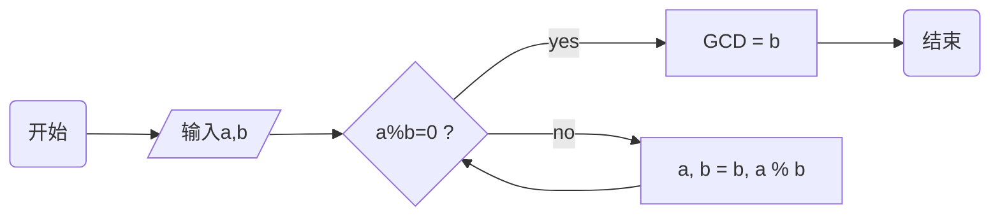

请忽略下图

[TOC]

## Introduction

## Typora+Picgo+Github搭建图床

1. Github上创建一个公开项目

2. 生成token（记得在电脑备份保存）

   > 点击GitHub头像 —>选择 settings —> Developer settings —>Personal access tokens —> Generate a personal access token

3. 下载`Picgo`，传送门 [https://hub.fastgit.org/Molunerfinn/PicGo/releases](https://hub.fastgit.org/Molunerfinn/PicGo/releases)

   - 设置图床 

     自定义域名设置：https://cdn.jsdelivr.net/gh/用户名/仓库名@分支

     

   - 设置Typora

     

     

4. 下载`Typora`，传送门[https://www.typora.io](https://www.typora.io)

## GitHub加速访问

- [https://github.com.cnpmjs.org](https://github.com.cnpmjs.org)

- [https://hub.fastgit.org](https://hub.fastgit.org)

- 无需下载像vscode一样在线阅读代码，只需要在GitHub 仓库域名后面加上 `1s`（1 秒内）

  [https://github1s.com/Gardennias/Personal-gallery](https://github1s.com/Gardennias/Personal-gallery)

## GitHub搜索技巧

1. `in:name xxx // 按照项目名搜索`
2. `in:readme xxx // 按照README搜索`
3. `in:description xxx // 按照description搜索`

在此基础可以增加筛选条件

1. `stars:>xxx // stars数大于xxx`
2. `forks:>3000 // forks数大于xxx`
3. `language:xxx // 编程语言是xxx`
4. `pushed:>YYYY-MM-DD // 最后更新时间大于YYYY-MM-DD`

## Changelog

Detailed changes for each release are documented in the [release notes](https://hub.fastgit.org/Gardennias/Personal-gallery/releases).

## Contribution

